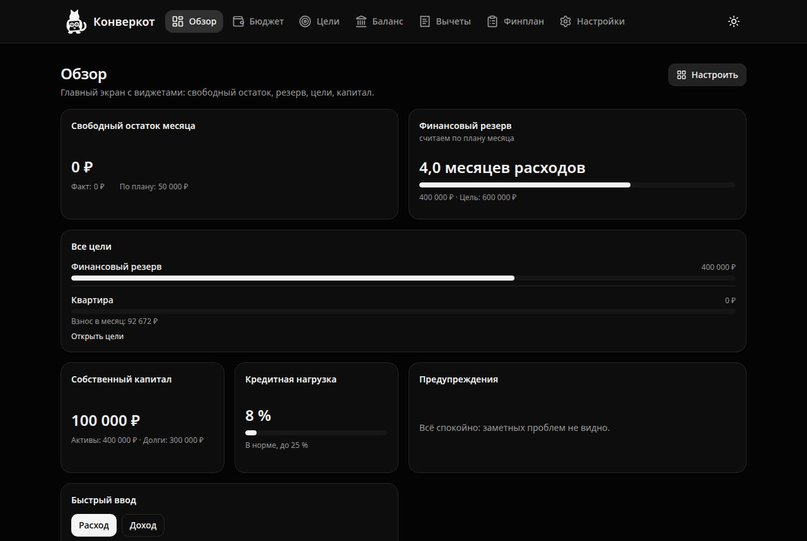
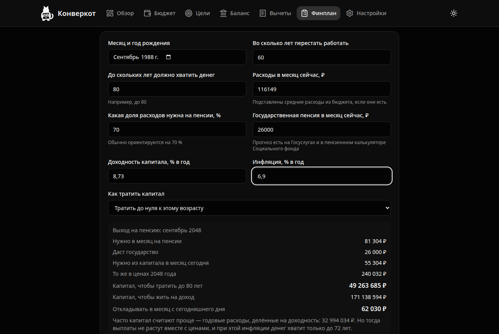

<p align="center">
  <a href="https://github.com/VPnus/konvert-me">
    
  </a>
</p>

<div align="center">

# Конверкот

### Личные финансы без облака: бюджет, цели, резерв, вычеты и финансовый план прямо на вашем устройстве.

<br/>

<a href="https://github.com/VPnus/konvert-me/releases"></a>
<a href="#-быстрый-старт"></a>
<a href="#-данные-и-приватность"></a>

<a href="https://github.com/VPnus/konvert-me/actions/workflows/ci.yml"></a>


</div>

> [!TIP]
> **Новое в 0.19.1:** кнопка языка в шапке: английский на расстоянии одного нажатия с лендинга, из знакомства и из приложения. Стартовые категории, счета знакомства и цель «Финансовый резерв» переезжают на язык приложения, а то, что вы переименовали сами, остаётся вашим. Вместо выбора страны теперь выбор бюджета: рублёвый или долларовый. **В 0.19.0:** два языка и две страны, экономика США: выплаты раз в две недели, вкладка «Налоговые счета» с лимитами 401(k), IRA, HSA и 529, свой порядок действий в финплане и импорт американских выписок.

---

## Что такое Конверкот

Конверкот помогает не просто записывать траты, а понимать, хватит ли денег на то, что задумано: квартиру, учёбу детей, спокойную пенсию. Он считает, сколько откладывать каждый месяц, раскладывает деньги по конвертам целей и показывает, куда движется капитал семьи. Всё работает в браузере без регистрации и без сервера: данные не покидают устройство.

**Главное:**

- **Цели с расчётом взноса:** сколько откладывать в месяц, чтобы успеть к сроку, с учётом инфляции и дохода на накопления
- **Бюджет «план-факт»:** операции, план по категориям и отклонение по каждой из них, за месяц и за год
- **Конверты:** деньги на счетах закрепляются за целями, и резерв не путается с накоплениями на квартиру
- **Налоговые вычеты:** сколько налога вернут за открытые годы и какие бумаги для этого собрать
- **Два языка и две страны:** русский и английский, Россия и США; от страны зависят валюта, нормативы и разделы, а для США есть «Налоговые счета» с лимитами 401(k), IRA, HSA и 529
- **Финансовый план:** диагностика, цели, защита, стратегия, действия и пересмотр в одном месте
- **Без облака:** офлайн, установка как приложение, резервная копия одним файлом с паролем

<br>

<div align="center">
  
</div>

## Кому пригодится

- **Семье с большой целью:** понять, сколько откладывать на квартиру и не пострадает ли от этого резерв
- **Родителям:** посчитать образование детей по годам учёбы, а не одной суммой «на всякий случай»
- **Тем, кто думает о пенсии:** увидеть, какой капитал нужен, чтобы выплаты росли вместе с ценами
- **Тем, кто возвращает налог:** не упустить вычет за лечение, обучение или жильё и собрать бумаги заранее
- **Тем, кто живёт в США:** считать зарплату раз в две недели, следить за лимитами 401(k), IRA, HSA и 529 и вести бюджет в долларах

## 🚀 Быстрый старт

**Что нужно:**

- Node.js 22 и npm
- Любой современный браузер

### Установка и первый запуск

```bash
# Скачать проект
git clone https://github.com/VPnus/konvert-me.git
cd konvert-me

# Установить зависимости
npm install

# Запустить приложение
npm run dev
```

> [!NOTE]
> Приложение откроется на `http://localhost:5173`. Первый запуск предложит пять коротких вопросов о доходах, расходах и первой цели. Из ответов сразу появятся бюджет, счета и дашборд. Любой шаг можно пропустить.

---

## Как пользоваться

- **В браузере:** просто откройте приложение; всё сохраняется в этом браузере
- **Как приложение:** установите его из меню браузера. Так данные надёжнее защищены от очистки, а Safari не сотрёт их через неделю без посещений
- **Без интернета:** после первого открытия приложение работает офлайн, включая сборку PDF
- **На другом устройстве:** сохраните резервную копию в «Настройках» и откройте её там
- **С клавиатуры:** до любой кнопки и поля можно дойти по Tab, у всех есть подписи для экранного диктора, а контраст текста не ниже WCAG AA в обеих темах
- **В пилоте:** через неделю и через месяц приложение предложит поделиться впечатлениями и короткой статистикой из «Настроек». Отправлять её или нет, решаете вы

---

## ✨ Возможности

### Обзор

Главный экран из виджетов, который каждый складывает под себя:

- **Свободный остаток месяца** и **финансовый резерв:** на сколько месяцев хватит денег
- **Цели:** прогресс и взнос в месяц по каждой
- **Собственный капитал** и **кредитная нагрузка** со статусом «в норме», «внимание» или «напряжённо»
- **Лента «Скоро»:** платежи по кредитам, вся выписка кредитки к сроку, окончание вкладов и полисов
- **Напоминания по кредитке:** за неделю и за день до срока выписки, а после срока предупреждение о процентах
- **Быстрый ввод операции**, закладки, новости по своей ленте и сводка вычетов
- Виджеты перетаскиваются мышью и с клавиатуры, размер меняется за угол

### Бюджет и импорт выписок

- **Шесть видов операций:** доход, расход, возврат, перевод, корректировка и переоценка; переводы не попадают в расходы
- **План по категориям** прямо в таблице и копирование с прошлого месяца
- **Месяц и год:** план, факт и отклонение, итоги по группам расходов
- **Импорт выписок CSV и XLSX:** кодировка Windows-1251, десятичная запятая, правила категорий, защита от дублей и отмена импорта целиком
- **Свои категории** и архив; стартовая категория «Подписки и комиссии»
- **Перевод с кредитки** заранее показывает, до какого дня вернуть деньги и хватит ли на это свободных

### Цели и конверты

- **Взнос и срок:** стоимость к сроку с инфляцией, взнос в месяц, реальная доходность
- **Распределение свободных денег:** сначала основной долг по кредитам и резерв, потом цели по важности, с дефицитом по каждой
- **«Что если»:** ползунки срока, стоимости и доходности пересчитывают взнос на лету
- **Взнос как перевод:** деньги уходят на счёт цели и закрепляются в её конверте; конверт лежит только на счёте с деньгами, а не на квартире или машине

### Баланс

- **Счета и долги** с банком, ставкой и датами словами; остаток всегда считается из операций
- **Кредитка по договору:** день выписки, срок оплаты, минимальный платёж процентом, лимит и бесплатные переводы; видно, сколько внести без процентов и сколько лимита свободно
- **Проценты накопительных счетов** за прошлый месяц считаются по остатку каждого дня и записываются в одно касание
- **Доля в бизнесе**, недвижимость и автомобиль учитываются в капитале отдельными видами активов
- **График капитала** по месяцам
- **Страховые полисы** и проверка лимита страхования вкладов по банкам

### Вычеты

- **Нормативы 2023–2026 годов** с источником у каждого значения
- **Анкета:** дети, лечение, обучение, спорт, ИИС, покупка и продажа жилья
- **Возврат по прогрессивной шкале**, перенос остатка вычета за жильё отдельно по стоимости и процентам, налог с продажи и сроки декларации
- **Чек-лист бумаг**, хранение чеков и договоров и напоминание в январе

### Финплан

Восемь шагов от «где вы сейчас» до «когда пересмотреть»:

- **Диагностика:** тип бюджета, капитал, кредитная нагрузка, резерв и страховки из других вкладок; видно, хватает ли денег на платежи по долгам
- **Долги одной очередью:** выписка кредитки к сроку первой, дальше по ставке в сравнении со ставками своих накопительных счетов
- **Образование детей:** капитал к началу учёбы по годам и для сравнения одной суммой
- **Пенсия:** сколько нужно в ценах года выхода на пенсию, капитал для жизни на доход и для трат до выбранного возраста, взнос с сегодняшнего дня
- **Хватает ли бюджета** на все цели и что делать, если нет
- **Защита:** резерв и страховка от главных рисков
- **Стратегия:** пример распределения накоплений по классам активов с учётом срока цели и отношения к риску
- **Действия** с отметками и **напоминание о пересмотре** раз в квартал и раз в год
- **PDF** со всем планом, который открывается и печатается где угодно

<div align="center">
  
</div>

---

## 🔒 Данные и приватность

- **Своего сервера нет.** Всё хранится в браузере (IndexedDB) на вашем устройстве
- **Ни аналитики, ни сторонних скриптов, ни шрифтов с чужих доменов**
- **Резервная копия:** один JSON-файл со всеми данными и документами, по желанию зашифрованный паролем (AES-GCM, PBKDF2)
- **Предупреждения о риске потери данных:** приватное окно, нехватка места, Safari без установки
- **В интернет уходит мало:** проверка новой версии на том же сайте раз в час, пока приложение открыто, и виджет «Новости», только если вы сами включите внешние источники. Финансовые данные не передаются никогда
- **Письмо о проблеме** уходит из вашей почты и только если вы его отправите; техническая информация в нём видна до отправки, данных из приложения там нет
- **Статистика пилота** только количества: сколько дней пользовались, сколько целей, счетов и операций. Сумм, названий и имён в ней нет, и никуда сама она не уходит
- **Политика конфиденциальности** открывается на сайте по адресу `/privacy`, со знакомства и из подвала приложения

---

## 🧮 Как считаются деньги

Все расчёты живут в чистых функциях `src/core` и закрыты тестами с числами, пересчитанными независимо:

- Суммы хранятся в **целых копейках**, прогнозы округляются только при выводе
- **Месячная ставка** равна годовой, делённой на 12, а инфляция считается как `(1 + π)^(месяцы / 12)`
- **Взнос** учитывает, что уже накопленное тоже приносит доход
- **Срок при заданном взносе** ищется перебором, а не бинарным поиском: цель дорожает и может снова «убежать»
- **Выводы не зависят от числа:** тип бюджета, кредитная нагрузка и распределение считаются по среднему за полные месяцы, а не по месяцу, который ещё идёт
- **Пенсионный капитал** считается через реальную доходность, с выплатами в начале года, растущими вместе с ценами

Примеры, которые обязаны сходиться до копейки: взнос **120 599,05 ₽** на квартиру за 4 млн через 3 года; **44 227,02 ₽** в месяц на образование ребёнка через 8 лет; пенсионный капитал **171 138 881 ₽** для жизни на доход и **49 263 768 ₽** на 20 лет.

---

## 🛠️ Разработка

```bash
npm run dev        # дев-сервер
npm run build      # проверка типов и сборка
npm run lint       # ESLint, предупреждения запрещены
npm run typecheck  # tsc
npm test           # модульные тесты (Vitest)
npm run coverage   # тесты с покрытием, порог для src/core 95 %
npm run e2e        # Playwright: сам собирает проект и поднимает preview
npm run icons      # перерисовать иконки из одного исходника логотипа
npm run og-image   # перерисовать картинку превью ссылки
npm run deploy     # опубликовать сайт на GitVerse Pages (только из коммита)
```

> [!NOTE]
> Перед первым запуском e2e: `npx playwright install chromium`. Сценарии идут в двух ширинах экрана (1280 и 375 px), среди них регрессии проверки на двух людях. Отдельно проверяются скорость на 10 000 операций и доступность: контраст, клавиатура и подписи на всех экранах в обеих темах.

### Архитектура

```
src/core       чистые функции: деньги, даты, цели, бюджет, баланс, вычеты, пенсия, образование
src/db         Dexie: схема, миграции, репозитории (единственная дверь к данным)
src/features   экраны вкладок; виджеты дашборда в overview/widgets; лендинг и политика в site
src/components общие компоненты
src/i18n       все тексты интерфейса на русском
```

Ядро не знает ни о React, ни о базе. Это правило проверяет ESLint.

### Стек

TypeScript (strict) · React 18 · Vite · Tailwind CSS · shadcn/ui · React Router · Dexie · Zod · date-fns · dnd-kit · Recharts · PapaParse · ExcelJS · pdfmake · vite-plugin-pwa · Vitest · Playwright

## Документация

| Файл                           | О чём                                                         |
| ------------------------------ | ------------------------------------------------------------- |
| [docs/PLAN.md](docs/PLAN.md)   | Полное ТЗ: формулы и тестовые векторы, модель данных, этапы   |
| [docs/PILOT.md](docs/PILOT.md) | Пилот: метрики, хостинг, публикация, анкета и календарь       |
| [CHANGELOG.md](CHANGELOG.md)   | История изменений по версиям                                  |
| [STACK.md](STACK.md)           | Стек, зависимости, команды, где что хранится, показатели      |
| [STRUCTURE.md](STRUCTURE.md)   | Дерево файлов с пояснениями и статистика по модулям           |
| [CLAUDE.md](CLAUDE.md)         | Правила работы над проектом: жёсткие правила и порядок этапов |

## Состояние

| Этап | Что                                        | Статус |
| ---- | ------------------------------------------ | ------ |
| 0    | Каркас: оболочка, маршруты, тема, PWA, CI  | готово |
| 1    | Финансовое ядро                            | готово |
| 2    | Хранилище, счета, резервные копии          | готово |
| 3    | Знакомство и «Обзор» из виджетов           | готово |
| 4    | «Бюджет»: операции, план-факт, месяц и год | готово |
| 4b   | Импорт выписок (CSV, XLSX)                 | готово |
| 5    | «Цели»: конверты, «что если»               | готово |
| 6    | «Баланс»: полисы, динамика капитала        | готово |
| 7    | «Вычеты»: возврат налога, бумаги, продажа  | готово |
| 8    | «Финплан»: образование, пенсия, PDF        | готово |
| MVP  | Скорость на 10 000 операций                | готово |
| MVP  | Доступность: контраст, клавиатура, подписи | готово |
| MVP  | Сайт: лендинг, политика, статистика пилота | готово |
| MVP  | Сайт опубликован: konverkot.gitverse.site  | готово |
| MVP  | Кредитка с льготным периодом (0.18.0)      | готово |
| MVP  | Пилот на 10–20 людях                       | дальше |
| 9.1  | Язык: словари, форматы, `lang` страницы    | готово |
| 9.2  | Английский перевод (Konvercat)             | готово |
| 9.3  | Страна в данных и нормативах               | готово |
| 9.4  | Экономика США                              | готово |
| 9.5  | Проверка и выпуск 0.19.0                   | готово |

## Поддержать проект

**Нравится Конверкот?** Поставьте ⭐ на GitHub и расскажите тем, кто до сих пор считает бюджет в заметках.

## Благодарности

Конверкот стоит на плечах открытых проектов: [React](https://github.com/facebook/react), [Vite](https://github.com/vitejs/vite), [Dexie.js](https://github.com/dexie/Dexie.js), [Zod](https://github.com/colinhacks/zod), [Recharts](https://github.com/recharts/recharts), [dnd-kit](https://github.com/clauderic/dnd-kit), [PapaParse](https://github.com/mholt/PapaParse), [ExcelJS](https://github.com/exceljs/exceljs), [pdfmake](https://github.com/bpampuch/pdfmake), [Vitest](https://github.com/vitest-dev/vitest) и [Playwright](https://github.com/microsoft/playwright). Спасибо их авторам!

> [!WARNING]
> **Расчёты носят информационный характер и не являются индивидуальной инвестиционной рекомендацией.** Конверкот считает и объясняет, но не советует конкретные ценные бумаги, фонды или брокеров. Распределение по классам активов приведено как обучающий пример. Решения о деньгах вы принимаете сами.
